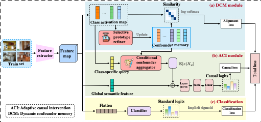

[](https://www.python.org/)
[](https://pytorch.org/)

# Prototype-based Causal Intervention for Multi-Label Image Classification

This repository contains the official PyTorch implementation of: **Prototype-based Causal Intervention for Multi-Label Image Classification (CVPR 2026)**

## Abstract

>Modern multi-label image classification models suffer from a critical reliance on spurious correlations, failing to learn the underlying causal mechanisms. Many causality-inspired methods are impractical, demanding box-level supervision that is rarely available in real-world datasets. Others rely on static confounder dictionaries, which are inherently inflexible and fail to capture complex biases or adapt to feature space changes during training. To address this, we present prototype-based causal intervention (ProCI), a novel framework that approximates the backdoor adjustment using only image-level supervision. It models confounders as learnable contextual prototypes which, unlike traditional prototypes designed for discriminative features, are engineered to represent class-wise co-occurring bias. These prototypes are learned dynamically within a stable memory and leveraged to construct sample-specific bias vectors for an adaptive feature adjustment, effectively counteracting spurious correlations. Experiments on MS-COCO, Pascal VOC, and the challenging Sewer-ML dataset validate our approach. ProCI achieves competitive performance on standard benchmarks while setting a new state-of-the-art on the highly-confounded Sewer-ML. It outperforms the previous best model by a remarkable +5.44 points on the $F2_{CIW}$ primary metric. These results demonstrate the effectiveness of our approach in mitigating complex real-world biases using only image-level supervision.

## Framework Overview



***Figure 1: Overview of the ProCI framework.***

## 1. Installation

To ensure reproducibility, we recommend using `conda` to create a dedicated environment.

1.1 **Open the repository:**

```bash
cd ProCI-main
```

1.2 **Create and activate the conda environment:**
This single command will create a new Conda environment named `ProCI` with all the necessary dependencies installed.

```bash
conda env create -f myenv.yml
```

1.3 **Activate the environment:**

```bash
conda activate ProCI
```

## 2. Data Preparation (Sewer-ML Example)

Our experiments are conducted on four datasets: **MS-COCO**, **Pascal VOC**, **COCO-Stuff** and the challenging **Sewer-ML**.

For the **Sewer-ML** dataset, you need to prepare the images and annotation files as described below.

### 2.1 Dataset Download

If you need to download the dataset, please be aware of the official backend limitations. We recommend using the `curl` command, modifying the download URL according to the following rules:

1. **Modify the URL Path**: The URL must be modified by changing `"/shared/"` to `"/public/"`.

   > The resulting public download link should be: `https://sciencedata.dk/public/Large%20AAU%20files/Sewer_ML`

2. **Download using `curl`**: The backend limits downloading all files at once; instead, each file must be provided in the command. We recommend downloading the `FILELIST.txt` file first, which contains all filenames.

   - The provided username does not matter.
   - Substitute `<SEWERMLPASSWORD>` with the real password.

```bash
# Example: Downloading FILELIST.txt 
curl --location-trusted -u username:<SEWERMLPASSWORD> -O "https://sciencedata.dk/public/Large%20AAU%20files/Sewer_ML/FILELIST.txt"
```

### 2.2 Directory Structure

To correctly load the dataset, ensure your data root directory (`<DATA_ROOT>`) follows this structure:

```python
<DATA_ROOT>/ 
└── sewer/
    ├── annotations/
    │   ├── SewerML_Train.csv
    │   ├── SewerML_Val.csv
    │   └── SewerML_Test.csv
    ├── Train/
    │   ├── <train_images>.jpg
    │   └── ...
    ├── Val/
    │   ├── <val_images>.jpg
    │   └── ...
    └── Test/
        ├── <test_images>.jpg
        └── ...
```

### 2.3 Path Configuration

You **must** update the hardcoded data paths within the main training script to point to your local file system.

In `ProCI-main/ProCI_train.py`, locate the **Sewer-ML** data loading block and modify the values for `annotations_dir` and `data_dir`:

```python
annotations_dir = '/path/to/your/SewerML/annotations' 
data_dir = '/path/to/your/SewerML/Data/Root'
```


## 3. Training and Evaluation

To run our proposed **ProCI** model on the Sewer-ML datasets, execute the corresponding experiment script:

```bash
# (Optional) Specify GPUs if you have multiple devices
export CUDA_VISIBLE_DEVICES=0,1
# Launch distributed training.
# Change --nproc_per_node to match the number of GPUs you selected above.
torchrun --nproc_per_node=2 --master_port=29500 ProCI_train.py  --multiprocessing_distributed --dist-url env://  --dataset sewer-ml --batch-size 128 --workers 32 --pretrained --use_sam
```


## 4. Reproducibility and Results

All experiments are conducted on 2$\times$NVIDIA H800 GPUs (80 GB each) with CUDA 12.1 and PyTorch 2.3.

| Dataset    | Backbone   | Metric | Score |
| ---------- | ---------- | ------ | ----- |
| MS-COCO    | Swin-L     | mAP    | 91.4  |
| Pascal VOC | TResNet    | mAP    | 96.0  |
| Sewer-ML   | TResNet-L  | F2-CIW | 68.8  |
| COCO-Stuff | ResNet-101 | mAP    | 64.5  |

## 5. Citation

```latex
@InProceedings{Li_2026_CVPR,
    author    = {Li, Yanmin and Mao, Zhilong and Wang, Mao and Liu, Lihua and Wu, Jibing and Bao, Weidong},
    title     = {Prototype-based Causal Intervention for Multi-Label Image Classification},
    booktitle = {Proceedings of the IEEE/CVF Conference on Computer Vision and Pattern Recognition (CVPR)},
    month     = {June},
    year      = {2026},
    pages     = {24738-24747}
}
```

## 6. License

MIT License
